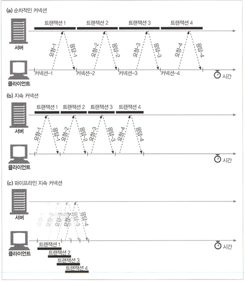

# 4장 커넥션 관리

## TCP 커넥션

- 모든 HTTP 통신은 TCP/IP를 통해 이루어짐
- 일단 커넥션이 맺어지면 메시지들은 손상되거나 순서 바뀌지 않고 전달됨

HTTP 통신 단계

1. 브라우저가 URL에서 호스트명 추출하여 이에 대한 IP 주소를 찾음
2. 브라우저가 포트번호를 얻음
3. 브라우저가 IP 주소, 포트번호를 이용해 TCP 커넥션을 생성
4. 브라우저가 HTTP GET 요청 메시지를 보냄
5. 브라우저가 서버에서 온 HTTP 응답 메시지를 익음
6. 브라우저가 커넥션을 끊음

TCP는 신뢰할 수 있는 데이터 전송 통로 -> HTTP는 TCP 커넥션이므로 신속 정확하게 통신 가능

TCP 스트림은 세그먼트로 나뉘어 IP 패킷 통해 전송됨

- HTTP 메시지 전송 시 TCP 커넥션 연결 후 메시지 데이터 내용을 순서대로 전송
- TCP가 세그먼트 단위로 데이터 스트림을 잘게 나누고, 세그먼트를 IP 패킷에 담아 인터넷을 통해 전달
- IP 패킷 포함 내용
    - IP 패킷 헤더(보통 20바이트) - IP 주소, 크기, 기타 플래그
    - TCP 세그먼트 헤더(보통 20바이트) - TCP 포트 번호, TCP 제어 플래그, 검증 숫자 값(데이터 순서, 무결성 검사)
    - TCP 데이터 조각(0 혹은 그 이상의 바이트)

커넥션 유지

- 포트 번호 통해 여러 커넥션 유지
    - 발신지 IP 주소, 발신지 포트, 수신지 IP 주소, 수신지 포트 네 가지로 TCP 커넥션 식별

소켓 프로그래밍

- 운영 체제가 제공하는 여러 기능을 사용할 수 있게 해주는 `소켓 API`를 여러 운영체제, 프로그래밍 언어에서 구현함
- 소켓 API를 쓰면 TCP 종단 데이터 구조를 생성하고, 운격서버 TCP 종단에 데이터 구조를 연결하여 데이터 스트림을 읽고 쓸 수 있음

HTTP 트랜잭션을 수행하기 위한 소켓 API의 사용 방법

1. 웹 서버가 커넥션을 기다리기 시작
2. 클라이언트는 URL에서 IP 주소와 포트 번호를 알아내고 서버에 TCP 커넥션 생성
3. 커넥션이 맺어지면 클라이언트가 HTTP 요청 전송
4. 서버가 요청을 다 받으면 분석 후 클라이언트가 원하는 동작 수행
5. 클라이언트에게 데이터 전송

### TCP 성능

HTTP 트랜잭션 성능은 TCP 성능에 영향을 받음

트랜잭션 지연

- DNS 찾기 -> 연결 -> 요청 -> 처리 -> 응답
- 대부분 HTTP 지연은 TCP 네트워크 지연 때문
- 주요 원인
    - DNS 이름 변환 지연
    - TCP 커넥션 생성 지연
    - 서버 처리 지연
    - 응답 전송 지연

- 성능 관련 중요 요소(고성능 HTTP 소프트웨어 개발 시 필요)
    - TCP 커넥션 핸드셰이크 지연
        - TCP 커넥션 핸드셰이크 과정
            1. 클라이언트가 SYN 플래그 포함 패킷 전송(커넥션 생성 요청)
            2. 서버가 커넥션 받고 요청이 받아들여지면, SYN+ACK 플래그 포함 패킷 전송
            3. 클라이언트가 커넥션이 잘 맺어졌음을 알리기 위해 확인응답 신호 전송
        - 크기가 작은 HTTP 트랜잭션은 TCP 커넥션 생성 시간으로 인한 지연
    - 혼잡 제어 위한 TCP 느린 시작(slow start)
        - TCP 커넥션은 처음에는 커넥션의 최대 속도를 제한하고(TCP 느린 시작) 데이터가 성공적으로 전송됨에 따라 속도 제한을 높여 나감(튜닝)
        - 인터넷의 급작스러운 부하와 혼잡 방지
        - TCP 느린 시작은 한 번에 전송할 수 있는 패킷의 수 제한
        - 이 혼잡 제어 기능 때문에 새로운 커넥션은 이미 어느 정도 데이터를 주고 받은 커넥션보다 느림
        - HTTP에 이미 존재한 커넥션을 재사용하는 기능 존재
    - 데이터를 한데 모아 전송하기 위한 네이글 알고리즘과 TCP_NODELAY
        - TCP가 작은 크기의 데이터를 포함한 많은 수의 패킷을 전송한다면 네트워크 성능은 크게 떨어짐
        - 네이글 알고리즘: 네트워크 효율을 위해서 패킷을 전송하기 전에 많은 양의 TCP 데이터를 '한 개의 덩어리'로 합침
        - 성능 관련 문제
            - 크기가 작은 메시지는 패킷을 채우지 못해 앞으로 생길지 안 생길지 모르는 추가 데이터를 기다리느라 지연
            - 확인응답 지연과 쓰일 때 성능 저하
    - TCP 편승(piggyback) 확인응답(acknowledgement) 위한 확인응답 지연 알고리즘
        - TCP는 세그먼트에 대한 순번과 데이터 무결성 체크섬을 가짐
        - 송신자가 특정 시간 안에 확인 응답 메시지를 받지 못하면 패킷이 파기 또는 데이터 다시 전송
        - 확인응답은 크기가 작기 때문에 같은 방향으로 송출되는 데이터 패킷에 편승(piggyback) -> 전송 효율화
        - 데이터 패킷 편승 늘리기 위해 '확인응답 지연 알고리즘' 사용
        - 확인응답 지연은 송출할 확인응답을 특정 시간 동안 버퍼에 저장해두고 확인응답을 편승시키기 위한 송출데이터 패킷을 찾음
            - 일정 시간 내 송출데이터 패킷 못 찾으면 별도 패킷 생성 후 전송
        - HTTP에서는 요청과 응답 두 가지 형식 뿐이라 데이터 패킷 편승 기회 적음 -> `확인응답 지연 알고리즘 으로 인한 지연 발생`
        - 지연 원인이 되는 확인응답 지연 관련 기능 수정, 비활성화 가능
    - TIME_WAIT 지연 포트 고갈
        - 성능 측정 시에 심각한 성능 저하, 실제로는 문제 안 됨
        - TCP 커넥션을 끊으면, 종단에서 커넥션의 IP 주소와 포트번호를 제어 영역에 기록해두고 일정 시간(보통 2MSL, 2분 정도)동안 동일 IP, 포트 사용 커넥션 생성 방지
        - 성능 측정 시 새로운 발신지 IP 주소(보통 하나의 클라이언트에서 접속하므로 고정), 포트 수(사용할 수 있는 포트 제한 있음) 조합은 한계가 있음 -> 서버가 맺을 수 있는 커넥션 제한

### HTTP 커넥션 관리

- Connection 헤더
    - 현재 맺고 있는 커넥션에만 적용될 옵션 지정(커넥션 토큰은 쉼표로 구분, 다른 커넥션에 전달하면 안 됨)
    - 커넥션 토큰은 헤더 필드명(이 커넥션에만 해당. 홉바이홉 헤더 명), 임시 토큰(비표준 옵션), close 값(작업 완료시 커넥션 종료)으로 구성
        - ex. Connection: meter, close, bill-my-credit-card
        - meter 헤더는 다른 커넥션 전달 불가, 이 트랜잭션 끝나면 커넥션 해제, bill-my-credit-card 옵션 사용
- 순차적인 트랜잭션 처리에 의한 지연
    - 예를 들어, 이미지 3개인 웹 페이지는 HTML 받기 위한 커넥션과 각 첨부된 이미지 받기 위한 커넥션 4개의 커넥션이 필요
    - 커넥션 맺기 지연과 느린 시작 지연 발생

### 병렬 커넥션

여러 개의 TCP 커넥션을 통한 동시 HTTP 요청

- 순차 처리보다 빠름(대역폭 제한과 대기 시간을 줄일 수 있으므로)
- but, 항상 빠르지는 않음(네트워크 대역폭이 좁을 때)
- 다수의 커넥션은 (서버의) 메모리 소모가 많고 성능 문제 발생시킴
- 병렬 커넥션은 더 빠르게 '느껴질 수' 있음(화면 전체에서 여러 작업이 일어나는 것이 보이므로)

### 지속 커넥션

커넥션을 맺고 끝는 데서 발생하는 지연을 제거하기 위한 TCP 커넥션의 재활용

- HTTP 1.1 지원 기기는 TCP 커넥션 유지하여 앞으로의 HTTP 요청에 재사용 가능 -> 지속 커넥션
- 서버가 커넥션을 끊기 전까지는 트랜잭션 간에 커넥션을 유지
- 커넥션 맺기 위한 준비작업 시간 절약
- 느린 시작 지연 회피 -> 빠른 데이터 전송 가능
- 병렬 커넥션 단점
    - 새로은 커넥션 연결/해제 때문에 시간과 대역폭 소요
    - 새로운 커넥션들은 TCP 느린 시작 때문에 성능 떨어짐
    - 병렬 커넥션 수에 제한이 있음
- 지속 커넥션 장점
    - 사전 작업, 지연 줄여줌
    - 튜닝된 커넥션 유지
    - 커넥션 주 절감
    - but, 잘못 관리하면 커넥션 쌓임 -> 로컬 리소스, 원격 클라이언트 ,서버 리소스 불필요한 낭비
- 병렬, 지속 커넥션 같이 사용할 때 가장 효과적
- HTTP 1.0 부터 keep-alive 커넥션을 실험적으로 확장해왔고, 1.1에서 기존 문제들이 수정됨
- keep-alive 동작
    - 요청에 Connection:Keep-alive 헤더 포함
    - 요청을 받을 서버는 응답에 같은 헤더 포함(없으면 연결 해제할 것으로 추정)
- keep-alive 옵션
    - 서버는 keep-alive 요청 받아도 따를 필요 없음
    - Keep-Alive 헤더로 keep-alive 옵션 제어(쉼표로 구분)
        - timeout 파라미터: 커넥션 유지 시간(강제 아님)
        - max 파라미터: 몇 개의 트랜잭션 처리할 때까지 유지되는지(강제 아님)
        - Connection:Keep-Alive 헤더 있을 때만 사용 가능
    - 제한과 규칙
        - 1.1에서는 기본 사용 아님(Connection:Keep-Alive 보내야 함)
        - 연결 해제 전 엔티티 본문 길이 알 수 있어야 유지할 수 있음
            - 엔티티 본문이 정확한 Content-length 값과 함께 멀티 파트 미디어형식, 청크 전송 형식으로 인코딩되어야 함
        - 프록시와 게이트웨이는 Connection 헤더 규칙 철저히 지켜야 함
            - 메시지 전달, 캐시 전에 Connection 헤더에 명시된 모든 헤더 필드와 Connection 헤더를 제거 해야 함
            - Connection 헤더를 인식하지 못하는 프록시 서버와 연결하면 안 됨 -> dumb proxy 방지
        - HTTP/1.0 따르는 기기로부터 받는 모든 Connection 헤더 필드는 무시해야 함 -> 오래된 프록시에서 실수로 전달되는 것 방지
    - dumb proxy
        - Connection 헤더를 이해하지 못하는 프록시들은 홉바이홉 헤더인 Connection 헤더에 대한 처리 없이 요청을 그대로 전달하는 경우 있음
        - dumb proxy 때문에 프록시와 서버 간에 커넥션이 해제되지 않고 클라이언트의 새로운 요청은 응답없이 로드 중이라고만 나오다 타임아웃으로 커넥션이 끊김
        - 이를 피하려면 프록시는 Connection 헤더와 Connection 헤더에 명시된 헤더는 절대 전달 금지
        - 넷스케이프의 해결책
            - Proxy-Connection이라는 확장 헤더를 사용하여 모든 헤더를 무조건 해결하는 문제 해결
            - 멍청한 프록시는 Proxy-Connection 헤더를 그대로 전달
            - 영리한 프록시는 Proxy-Connection를 Connection 헤더로 변환
            - bur, 멍청한 프록시 양 옆에 영리한 프록시 있으면 다시 문제 발생
- HTTP/1.1의 지속 커넥션
    - 1.1에서는 keep-alive 지원하지 않고, 더 개선된 지속 커넥션 지원
    - 지속 커넥션이 기본적으로 활성화됨
    - 커넥션 끊으려면 Connection:close 헤더 명시해야 함
    - 제한과 규칙
        - 연결 해제 전 엔티티 본문 길이 알 수 있어야 유지할 수 있음
            - 엔티티 본문이 정확한 Content-length 값과 함께 멀티 파트 미디어 형식, 청크 전송 형식으로 인코딩되어야 함
            - HTTP/1.1 프록시는 클라이언트와 서버 각각에 대해 별도 지속 커넥션을 맺고 관리해야 함
            - HTTP/1.1 프록시 서버는 클라이언트가 커넥션 관련 기능에 대한 자신의 지원 범위를 모르면 커넥션을 맺으면 안 됨
                - 오래된 프록시가 Connection 헤더 전달 방지
            - HTTP/1.1 애플리케이션은 중간에 끊어지는 커넥션을 복구할 수 있어야 함
            - 클라이언트는 응답 수신 전 연결 해제 시, (재전송해도 문제 없다면) 요청 재전송 준비되어 있어야 함
                - 하나의 사용자 클라이언트는 서버 과부하 방지를 위해 넉넉잡아 두 개의 지속 커넥션만을 유지해야 함

### 파이프라인 커넥션

공유 TCP 커넥션을 통한 병렬 HTTP 요청

- HTTP/1.1은 지속 커넥션을 통해서 요청 파이프 라이닝 가능
- 여러 개의 요청은 응답이 도착하기 전까지 큐에 쌓임
    - 첫 번째 요청이 서버에 전달된 후, 두 번째, 세 번째 요청도 전달될 수 있음
    - 대기 시간이 긴 네트워크 상황에서 네트워크 왕복으로 인한 시간을 줄여서 성능 향상
- 제약사항
    - 클라이언트는 커넥션이 지속 커넥션인지 확인하기 전까지 파이프라인 연결 금지
    - 요청 순서와 같게 와야 함(HTTP 메시지는 순번이 매겨져 있지 않아서 순서 없이오면 정렬 방법 없음)
    - 클라이언트는 커넥션이 언제 끊어지더라도 완료되지 않은 파이프라인에 있으면 요청 재전송 준비 되어 있어야 함
    - POST 요청 같이 반복해서 보낼 경우 문제가 생기는 요청(비멱등 요청)은 파이프라인 전송 금지
    -

### 다중 커넥션

요청과 응답들에 대한 중재(실험 중)

### 커넥션 끊기의 미스터리

- 마음대로 커넥션 끊기
    - 클라이언트, 서버, 프록시 모두 언제든지 TCP 커넥션 전송 끊을 수 있음(에러가 없어도)
- Content-Length, Truncation
    - 각 HTTP 응답은 본문의 정확한 크기 값을 가지는 Content-Length 헤더를 가지고 있어야 함
    - 클라이언트나 프록시가 커넥션이 끊어졌다는 HTTP 응답을 받은 후 실제 전달된 엔티티의 길이와 Content-Length 값이 다르면 정확한 길이를 서버에게 질의
    - 수신자가 캐시 프록시면, 응답을 캐시하면 안 되며, Content-Length를 정정하지 말고 그대로 전달해야 함
- 커넥션 끊기의 허용, 재시도, 멱등성
    - 클라이언트가 트랜잭션 수행 도중 전송 커넥션 끊기면 클라이언트는 (재전송해도 문제 없다면) 커넥션 맺고 재전송 시도해야 함
    - 파이프라인 커넥션에서는 큐에 여러 요청을 남겨 두고 커넥션을 끊게 되면 클라이언트는 서버에서 실제로 얼마만큼 요청이 처리됐는지 알 수 없음
        - 비멱등한(여러 번 실행하면 같은 결과 반환하지 않는) POST 같은 요청은 중복 처리될 것임
- 우아한 커넥션 끊기
    - 커넥션 양 쪽에는 데이터를 읽거나 쓰기 위한 입력 큐, 출력큐가 있고, 한쪽 출력큐에 있는 데이터는 다른 쪽의 입력 큐에 전송됨
    - 전체 끊기: 입력 채널과 출력 채널 둘 다 끊기 ex) close() 호출 시
    - 절반 끊기: 입력 채널과 출력 채널 중 하나 끊기 ex) shutdown() 호출 시
    - 애플리케이션이 각기 다른 클라이언트, 서버, 프록시와 통신 할 때와 그들과 파이프라인 지속 커넥션 사용 시 에라 방지 위해 '절반 끊기' 사용
    - 출력 끊기가 안전
    - 클라이언트가 더이상 데이터 보내지 않는 것을 확신 못 하면 입력 채널 끊기는 위험함
        - 클라이언트의 운영체제는 이를 심각한 위험으로 인식해 버퍼에 저장된, 아직 읽히지 않은 데이터를 모두 삭제함
    - 우아하게 커넥션을 끊으려면, 애플리케이션 자신의 출력 채널 먼저 끊고, 상대 기기의 출력 채널이 끊기길 기다림
    - but, 상대방이 절반 끊기 구현했는지 알 수 없기에, 자신의 출력 채널 끊고 입력 채널에 대해 상태 검사를 주기적으로 해야 함
    - 타임아웃 시간 내에 끊어지지 않으면, 강제 연결 해제

