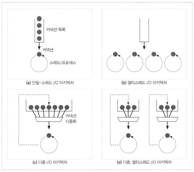

# 5장 웹 서버

웹 서버: HTTP 요청을 처리하고 응답을 제공하는 소프트웨어와 장비(컴퓨터)

- 웹 서버 구현
    - 웹 서버는 HTTP, TCP 처리를 구현한 것
    - 제공하는 리소스를 관리하고, 서버 관리 기능(설정, 통제, 확장) 제공

### 웹서버가 하는 일

1. 클라이언트 커넥션 수락
    - 클라이언트가 커넥션 요청 시, 서버는 커넥션 맺고 IP 주소를 추출해 클라이언트 정보를 확인
    - 역방향 DNS 사용해 IP 주소를 클라이언트호스트명으로 변환하도록 설정되어 있음
    - 몇몇 웹 서버는 IETF ident 프로토콜을 지원하여 어떤 사용자 이름이 HTTP 커넥션을 초기화했는지 찾아낼 수 있음
2. 요청 메시지 수신
    - 커넥션에 데이터가 도착하면 서버가 데이터를 읽어 들여 파싱하고 요청 메시지를 구성함
    - 몇몇 웹서버는 요청 메시지를 쉽게 다룰 수 있도록 자료 구조에 저장함
    - 고성능 웹서버는 수 천 개의 커넥션을 동시에 열 수 있도록 지원함
        - 
        - 단일 스레드 웹서버
            - 한 번에 하나의 요청을 처리(심각한 성능 문제)
        - 멀티프로세스와 멀티스레드 웹 서버
            - 여러 요청 처리 위해 여러 개의 프로세스 또는 고효율 스레드 할당
            - 필요할 때마다 만들어지거나 미리 만들어질 수 있음(worker pool)
            - 매 커넥션마다 스레드/프로세스 하나씩 할당하면 메모리나 시스템 리소스를 너무 많이 소비
                - 따라서, 멀티 스레드 웹서비스가 스레드/프로세스 최대 개수 제한
        - 다중 I/O 서버
            - 대량의 커넥션을 지원하기 위해 많은 웹서버는 다중 아키텍처 채택
            - 모든 커넥션은 동시에 활동을 감시당함
            - 커넥션의 상태가 바뀌면(가용 상태 또는 에러 발생 등) 그 커넥션에 대해 작은 양의 처리 수행
        - 다중 멀티 스레드 웹 서버
            - CPU 여러 개의 이점을 살리기 위해 멀티스레딩과 다중화(multiplexing)과 결합함
            - 여러 스레드는 각각 열려 있는 커넥션을 감시하고 각 커넥션에 대해 조금씩 작업 수행
3. 요청 처리
    - 웹 서버가 요청을 받으면, 메서드, 리소스, 헤더, 본문에서 얻어내서 처리함
    - OPTIONS를 비롯한 다수의 메서드는 본문이 있는 것을 허용하되 요구하지 않음
    - POST를 비롯한 몇몇 메서드는 요청 메시지에 본문이 있을 것을 요구함
    - GET은 본문이 없는 것을 금지
4. 리소스의 매핑과 접근
    - 웹 서버는 리소스 서버
    - 미리 만들어진 컨텐츠를 제공하거나 애플리케이션을 통해 만들어진 동적 컨텐츠 제공
    - 클라이언트에 컨텐츠 전달하려면 요청 URI에 대응하는 알맞은 컨텐츠나 컨텐츠 생성기를 웹 서버에서 찾아 그 원천을 식별해야 함
    - Docroot(문서 루트)
        - 가장 단순한 리소스 매핑: 요청 URI를 파일 시스템의 파일 이름으로 사용하는 것
        - 특별한 폴더를 웹 컨텐츠를 위해 예약하고, Docroot 뒤에 요청 URI를 붙이는 방식
    - 가상 호스팅된 docroot
        - URI나 Host 헤더에서 얻은 IP 주소나 호스트명을 이용해 올바른 문서 루트를 식별
        - 웹 서버 위에 두 개의 사이트가 완전히 분리된 컨텐츠를 갖고 호스팅 되도록 함
        - 아파치 웹 서버에서는 VirtualHost 블록이 DocumentRoot 지시자를 포함하도록 설정
    - 사용자 홈 디렉터리 docroots
        - 사용자 홈 디렉터리 안에 있는 public_html(다르게 설정 가능)가 개인 docroot
    - 디렉터리 목록
        - 경로가 파일이 아닌 디렉터리를 가리키면, 에러를 반환하거나, 특정 색인 파일을 반환하거나, 디렉터리 내부에 그 내용을 담은 HTML 페이지를 반환함
        - 아파치 웹 서버에서는 DirectoryIndex 지시자 사용해서 기본 디렉터리 파일로 사용될 파일 이름들 설정 가능(기본적으로 index.html 등)
        - 많은 웹 서버에서 기본 색인 파일이 없고 디렉터리 인덱싱이 꺼져 있지 않으면 해당 디렉터리 파일 열거한 HTML 반환(보안 위협)
    - 동적 컨텐츠 리소스 매핑
        - URI를 동적 리소스(요청에 맞게 컨텐츠 생성하는 프로그램)에 매핑
        - WAS(프로그램 위치, 실행 방법 알고 있음)가 웹서버를 백엔드 애플리케이션과 연결
    - 서버 사이드 인클루드(SSI)
        - 어떤 리소스가 서버사이드 인클루드를 포함하고 있는 것으로 설정됐다면, 서버가 그 리소스의 컨텐츠를 보내기 전에 처리함
        - 컨텐츠에 변수 이름이나 내장된 스크립트가 될 수 있는 어떤 특별한 패턴이 있는지 검사 후 변수 값이나 스크립트 출력 값으로 치환됨
    - 접근 제어
        - 각각의 리소스에 접근 제어 할당 가능(12장 참조)
5. 응답 만들기
    - 서버가 리소스 식별하면, 요청 메서드로 서술되는 동작 수행한 뒤 응답 메시지 반환
    - 응답 엔티티 - Content-type 헤더(MIME 타입 서술), Content-length 헤더(응답 본문 길이), 응답 본문
    - MIME 타입 결정하기
        - 파일 이름 확장자 사용
            - 확장자별 MIME 타입이 담겨 있는 파일 탐색
        - 매직 타이핑
            - 파일 내용 검사해서 패턴에 대한 테이블(매직 파일)에 해당하는 패턴이 있는지 탐색
            - 느리지만 표준 확장자 없이 이름 지어진 경우 편리
        - 유형 명시
            - 파일 확장자나 내용에 상관 없이 어떤 MIME 타입 갖도록 웹 서버 설정 가능
        - 유형 협상
            - 한 리소스가 여러 종류의 문서 형식에 속하도록 설정 가능
            - 서버가 사용자와 협상 과정을 통해 가장 좋은 형식을 판별할지 여부 설정 가능
    - 리다이렉션
        - 웹 서버는 요청을 수행하기 위해 브라우저가 다른 곳으로 가도록 리다이렉트 가능
        - 유용한 경우
            - 리소스 영구 이동 - 301 Moved Permanently
            - 리소스 임시 이동 - 303 See Other, 307 Temporary Redirect
            - URL 증강(문맥, 상태 정보를 포함시키기 위해 재작성) - 303 See Other, 307 Temporary Redirect
            - 부하 균형 - 303 See Other, 307 Temporary Redirect
            - 친밀한 다른 서버 있을 때 - 303 See Other, 307 Temporary Redirect
            - 디렉터리 이름 정규화
                - 디렉터리 이름에 대한 URI 요청 시 빗금(/) 빠뜨렸다면, 슬래시를 추가한 URI로 리다이렉트
6. 응답 보내기
    - 응답 시에도 여러 클라이언트에 대해 많은 커넥션을 가질 수 있음
    - 서버는 커넥션 상태를 추적해야 하며, 지속적 커넥션은 주의해서 다뤄야 함
7. 로깅
    - 트랜잭션 수행 내용 로그를 로그 파일에 기록함